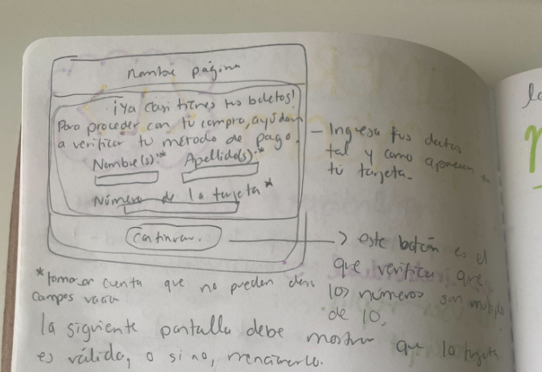
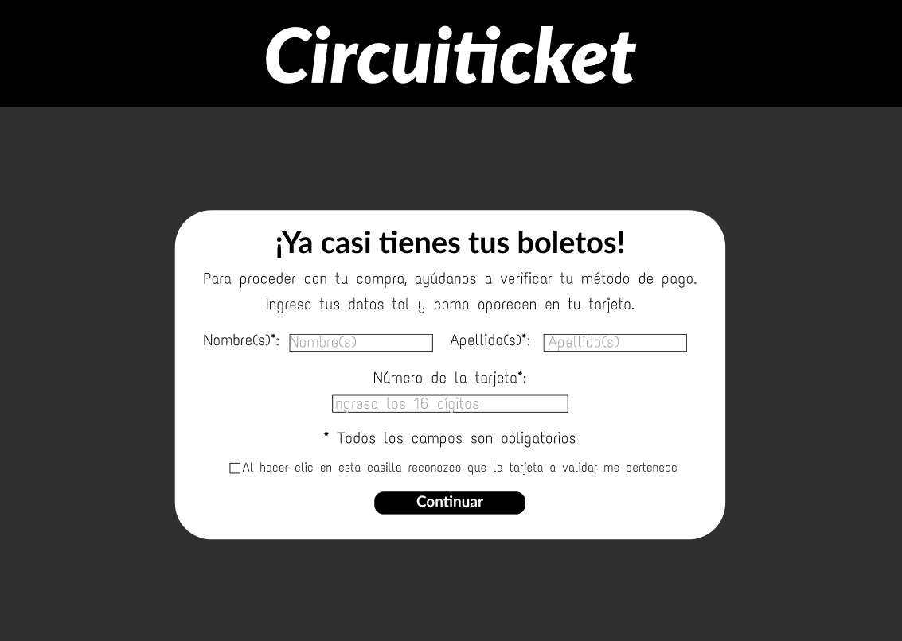
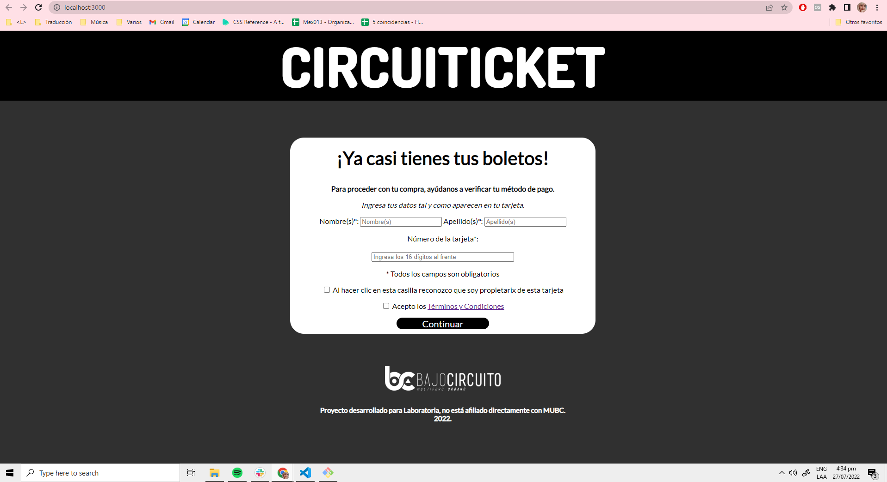
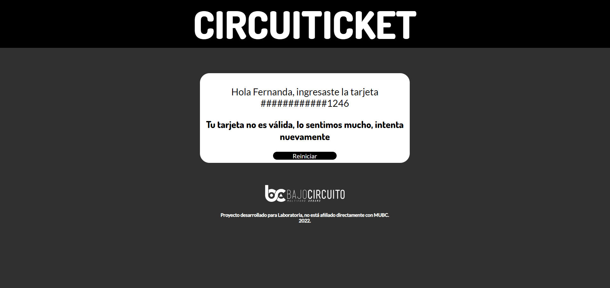
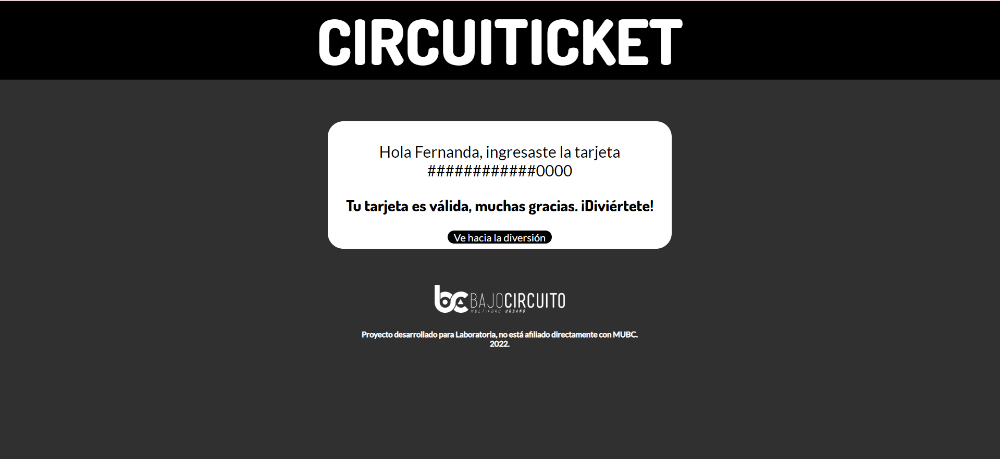

## Circuiticket

El objetivo de este proyecto es validar una tarjeta a través del [algoritmo de Luhn](https://es.wikipedia.org/wiki/Algoritmo_de_Luhn).

Los usuarios de Circuiticket son aquellas personas que desean adquirir boletos para algún concierto, fiesta o espectáculo que se lleve a cabo en el Multiforo Urbano Bajo Circuito, pues todos los eventos que se realicen en el recinto estarán agrupados en su sitio web y podrán comprarlos desde allí, sin necesidad de dirigírse a páginas externas o algúna locación física.  

_Disclaimer: "Circuiticket" se desarrolló como parte de un proyecto para Laboratoria y no está afiliado directamente con MUBC._

El primer prototipo se realizó en papel.  

Después, fue necesario crear un prototipo en Figma.  

En ambos casos, se recbió _feedback_ por parte de las compañeras del bootcamp. Algunas de las observaciones realizadas fueron hacer que ocupara menos espacio (cuando se mostró el espaciado en papel), cambiar el tipo de fuente del header para que estuviera más en línea con el branding del Foro, así como reducir el texto en el pie de página, al cual se añadió también el logotipo del lugar.  

Al final quedó de la siguiente manera. 

